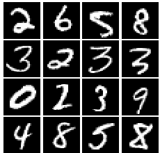
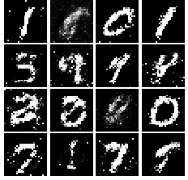
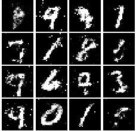
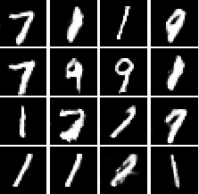

# GANs

Generate Number digits Using GANs

# Dataset

the dataset used is [MNIST](http://yann.lecun.com/exdb/mnist/), It consistes of images of the number digits. 

# Results

## Using Original GAN
it uses a fully connected layers for the discriminator and generator, and sigmoid_cross_entropy for the Loss. 

## Using Least Squares GAN
it's the same as the orginal GAN ,but it uses Least Squares Loss instead of sigmoid_cross_entropy Loss.

it's more stable than the orginal GAN and converge faster.

## Deep Convolutional GANs
it uses a CNN for the discriminator and generator.

it produces less noise and more clean photos.

# Dependencies

* [TensorFlow](https://www.tensorflow.org/versions/master/get_started/os_setup.html#download-and-setup)
* [NumPy](https://github.com/numpy/numpy/blob/master/INSTALL.rst.txt)

# Resources
- [CS321n - Stanford University](http://cs231n.stanford.edu/2017/index.html) 
